# DOTD 제6차 회의록
## 1차 기간 확정 및 미확정 사항 구분
**일시:** 2025.12.03

---

## 📋 회의 요약 구조

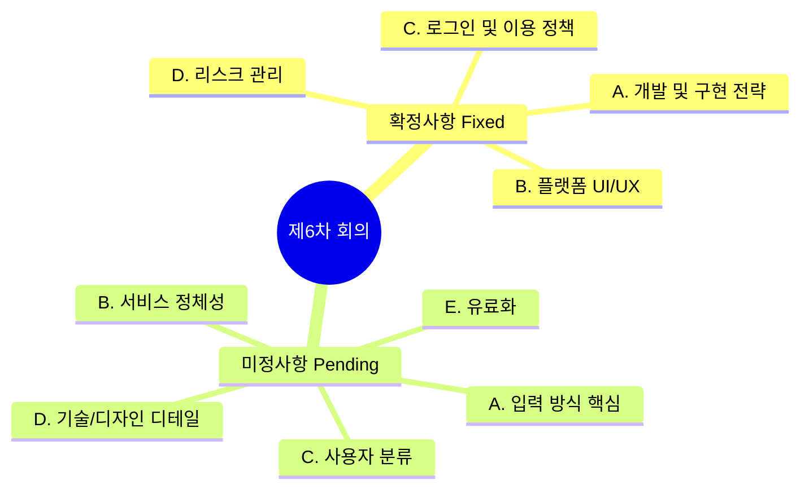

---

## 1. 확정된 사항 (Fixed)

### A. 개발 및 구현 전략

- **베이스 코드:** 강사님 제공 파일(로그인, DB, 관리자 페이지)을 기반으로 하여, 우리가 필요한 기능을 하나씩 이식하는 방식(Option B)으로 진행.
- **12월 10일 발표 범위:**
  - **시연:** 디자인 완성도보다는 [입력 → AI 처리 → 결과 출력]의 프로세스가 실제로 작동하는 것에 집중. (최소 1개 이상의 영상 생성 성공 시연)
  - **비전:** 이상적인 UI/UX는 **캡처 시안(이미지)**으로 별도 제시하여 2차 고도화 목표로 설명.
- **역할 분담:**
  - **기획:** 프롬프트 설계 및 로직 정의 전담.
  - **기술:** 기능 구현 및 코드 연결 전담.

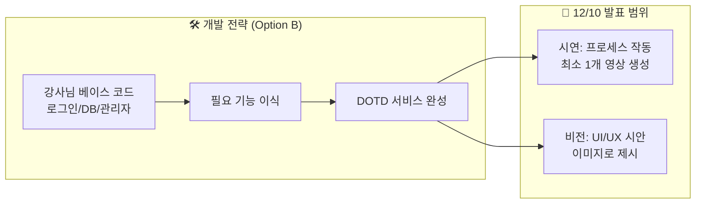

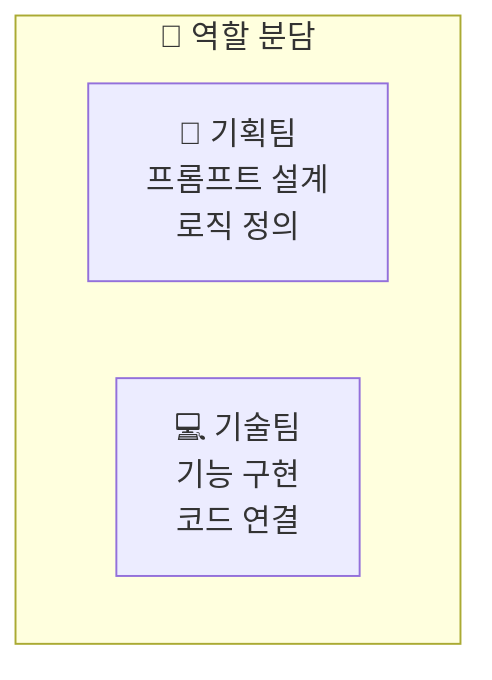

### B. 플랫폼 UI/UX

- **모바일 우선 (Mobile-First):** PC 화면보다는 모바일 사용 환경을 최우선으로 설계.
- **피드(Feed) 방식:** 인스타그램 릴스나 틱톡처럼 세로 스크롤 형태의 UI 채택.
- **메인 페이지 구성:**
  - **상단 3개:** 관리자가 선별한 고품질 영상/이미지를 고정 배너처럼 배치 (첫인상 관리).
  - **하단:** AI가 생성한 일반 콘텐츠가 피드 형태로 나열.

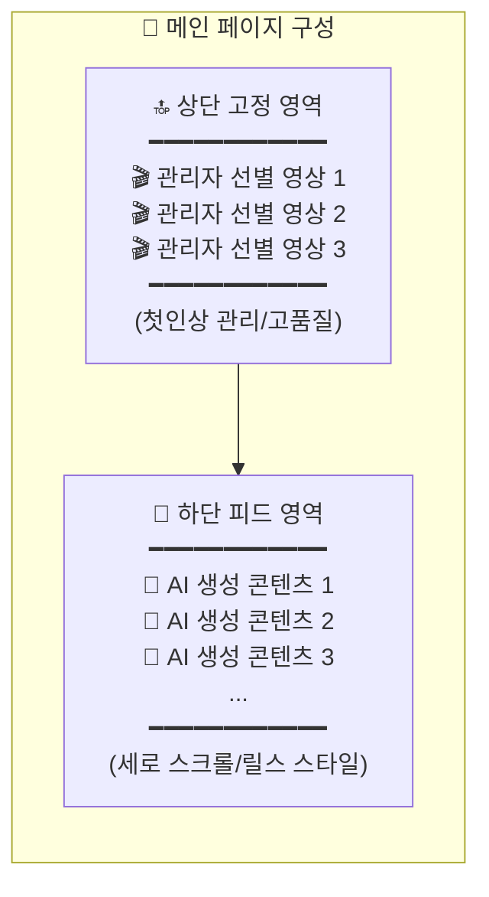

### C. 로그인 및 이용 정책

- **로그인 필수:** 영상/이미지 생성 및 저장을 위해서는 반드시 로그인 필요.
- **비회원:** 생성된 콘텐츠를 **둘러보기(Browsing)**만 가능.
- **이유:** DB에 유저 데이터(생성 이력) 저장 및 API 과금 방지를 위한 횟수 제한 관리 목적.

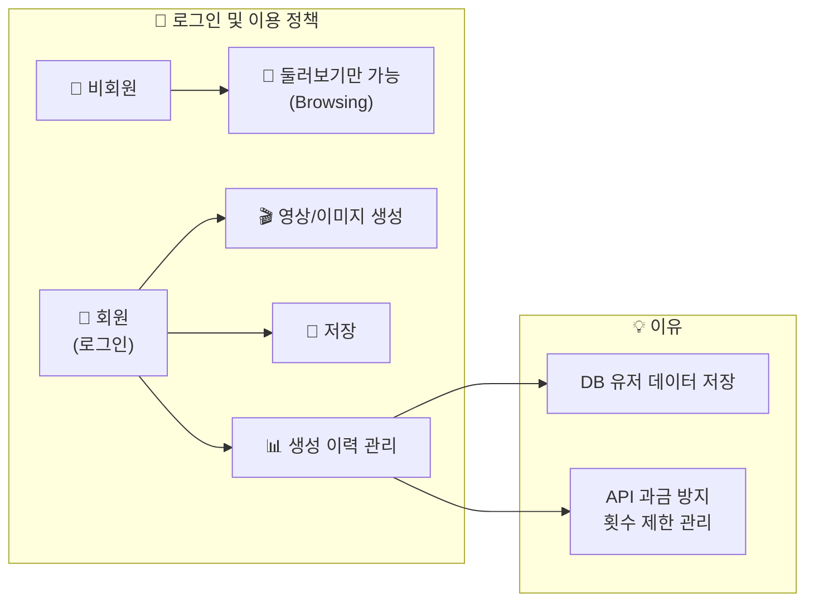

### D. 리스크 관리 (비용)

- **API 비용 통제:** 개발 단계에서의 무분별한 영상 생성 금지 (4만원 과금 이슈 대응).
  - **영상 테스트:** 기술 파트장이 연결 확인용으로 1회만 수행.
  - **프롬프트 테스트:** 무료 AI 도구(텍스트/이미지 단계)를 활용하여 로직 검증.

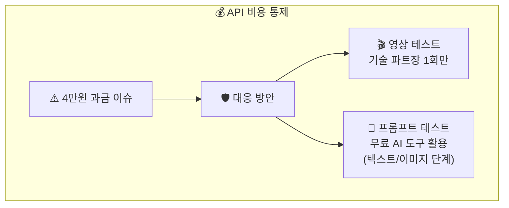

---

## 2. 미정 및 논의 필요 사항 (Pending)

### A. [핵심] 사용자의 '입력(Input)' 방식

- **현황:** 백엔드에는 5개의 전문가 페르소나 로직(조합 300억 개)이 있으나, 정작 **프론트에서 유저가 무엇을 입력할지** 결정되지 않음.
- **쟁점:**
  - **입력 형태:** 텍스트 입력(주관식) vs 버튼 선택(객관식: 장소, 체형, 스타일 등).
  - **통제 수준:** 사용자 입력을 그대로 반영(개방형) vs 내부 전문가 프롬프트로 변환하여 통제(통제형).
  - **배경 설정:** 런웨이 등 고정 배경 사용 vs AI가 상황에 맞춰 생성.

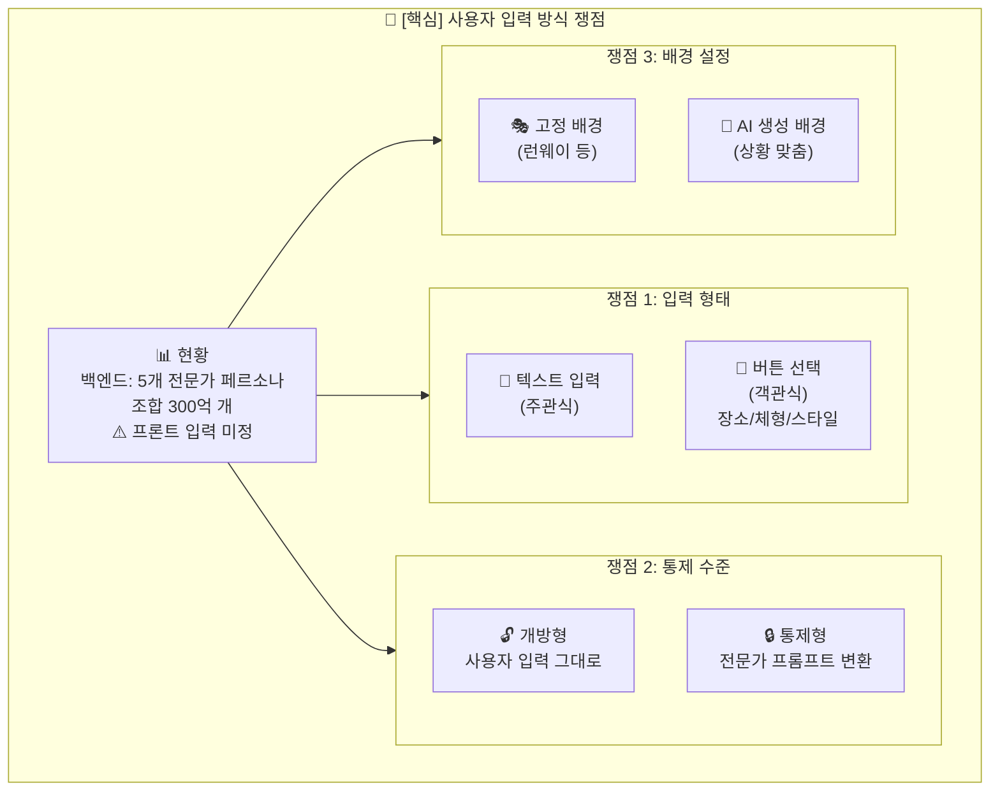

### B. 서비스 정체성 및 가치 (Concept)

- **쟁점:** 결과물이 주는 핵심 가치가 무엇인가?
  - **안 1 (현실적 조언):** "옷을 못 입는 사람에게 OOTD를 제안/컨설팅해 준다."
  - **안 2 (이상적 프로필):** "내 얼굴로 가장 멋진 가상 영상을 만들어준다." (SNS 업로드용, 엔터테인먼트)
  - **현재 흐름:** '이상적 프로필' 쪽으로 기울고 있으나 최종 합의 필요. → **(12월 10일 이후 결정)**

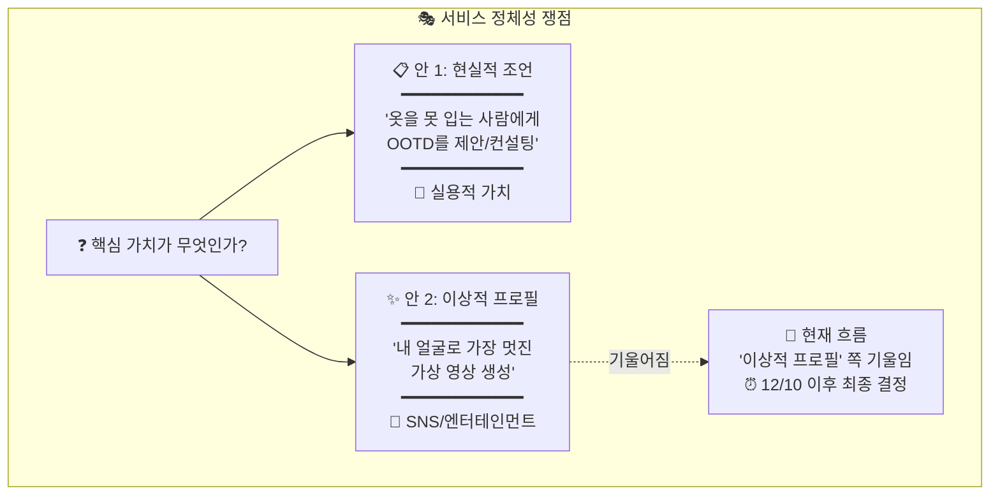

### C. 사용자 분류 (카테고리)

- **쟁점:** 기존의 [초보자 / OOTD / 트렌드세터] 3분할 방식을 유지할 것인가?
- **고민:** 사용자에게 혼란을 줄 수 있으므로 [OOTD(오늘 뭐 입지)] 하나로 통합하자는 의견 대두.

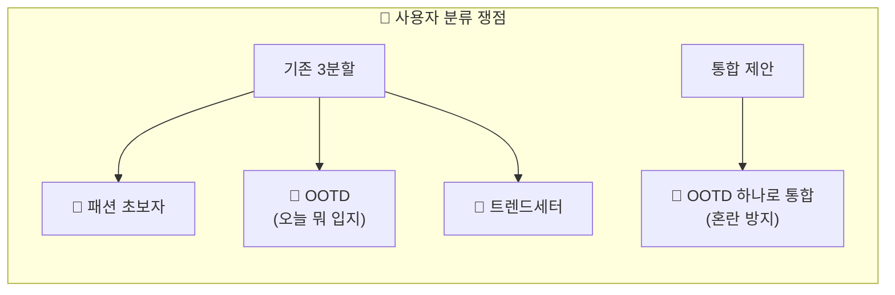

### D. 기타 기술/디자인 디테일

- **로딩 화면:** 영상 생성 대기 시간(약 5분) 동안 보여줄 화면 기획 (광고? 진행률? 재미 요소?).
- **기술 이슈:** 구글 로그인 연동 방식(강사님 소스와 충돌 여부), 영상 길이(8초?), 얼굴 합성 도입 여부.
- **브랜딩:** 서비스 정식 명칭, 로고, 첫 화면 소개 멘트.

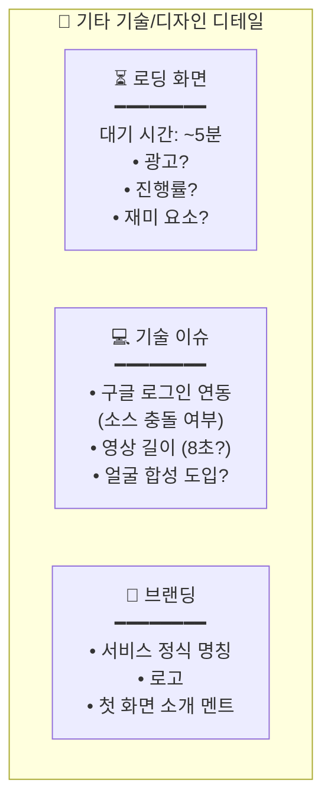

### E. 유료화 (12월 10일 이후 결정)

- 무료 체험 횟수, 과금 시점, 포인트 시스템 등은 우선순위에서 배제.

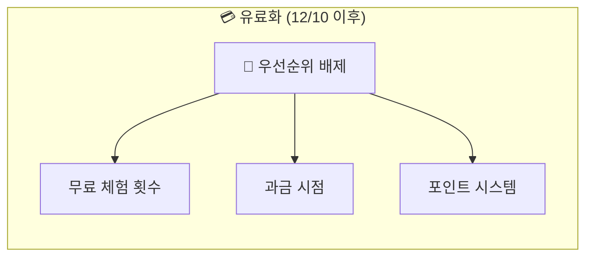

---

## 📊 전체 진행 상황 요약

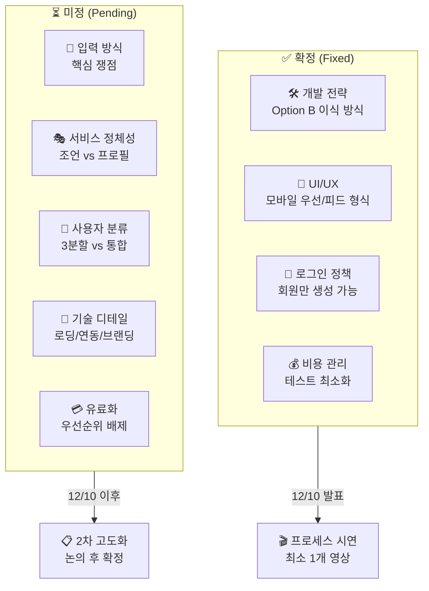

---

## 📅 일정 타임라인

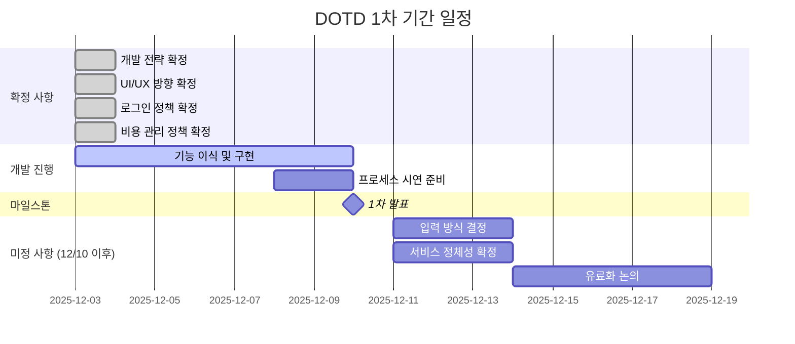

---

## ✅ Action Items

| 담당 | 항목 | 기한 | 상태 |
|------|------|------|------|
| 기획팀 | 프롬프트 설계 및 로직 정의 | 12/10 | 🔄 진행중 |
| 기술팀 | 베이스 코드 기능 이식 | 12/10 | 🔄 진행중 |
| 기술 파트장 | 영상 생성 연결 테스트 (1회) | 12/08 | ⏳ 예정 |
| 전체 | UI/UX 시안 캡처 준비 | 12/10 | ⏳ 예정 |
| 전체 | 입력 방식 논의 | 12/10 이후 | 📋 대기 |
| 전체 | 서비스 정체성 최종 확정 | 12/10 이후 | 📋 대기 |
