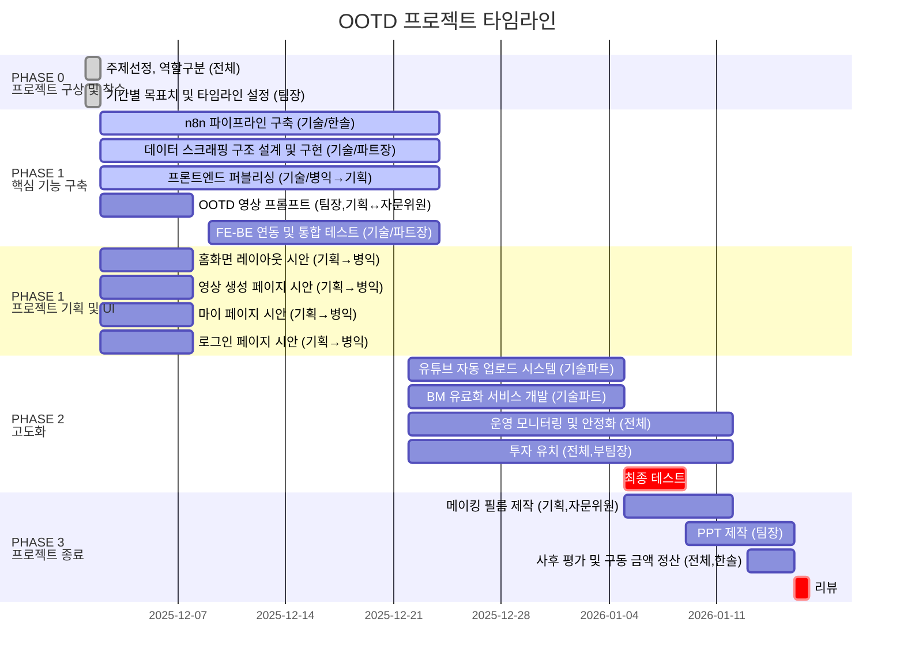

# OOTD 프로젝트 타임라인

## 프로젝트 기본 정보

| 항목 | 내용 |
|------|------|
| 프로젝트 이름 | OOTD : 오늘 뭐입동? |
| 프로젝트 관리자 | 김찬호 |
| 강사명 | 오상훈 |
| 날짜 | 25년 12월 2일 |

---

## 간트차트

---

## Phase별 Task 상세

### PHASE 0: 프로젝트 구상 및 착수

| Task | 담당자 | 진행 기간 |
|------|--------|----------|
| 주제선정, 역할구분 | 전체 | 완료 |
| 기간별 목표치 및 타임라인 설정 | 팀장 | 완료 |

### PHASE 1: 핵심 기능 구축

| Task | 담당자 | 진행 기간 |
|------|--------|----------|
| n8n 파이프라인 구축 | 기술 / 한솔 | 12/2 ~ 12/24 |
| 데이터 스크래핑 구조 설계 및 구현 | 기술 / 파트장 | 12/2 ~ 12/24 |
| 프론트엔드 퍼블리싱 | 기술 / 병익 → 기획 | 12/2 ~ 12/24 |
| OOTD 영상 프롬프트 | 팀장, 기획 ↔ 자문위원 | 12/2 ~ 12/8 |
| FE-BE 연동 및 통합 테스트 | 기술 / 파트장 | 12/9 ~ 12/24 |

### PHASE 1: 프로젝트 기획 및 UI

| Task | 담당자 | 진행 기간 |
|------|--------|----------|
| 홈화면 레이아웃 시안 | 기획 → 병익 | 12/2 ~ 12/8 |
| 영상 생성 페이지 시안 | 기획 → 병익 | 12/2 ~ 12/8 |
| 마이 페이지 시안 | 기획 → 병익 | 12/2 ~ 12/8 |
| 로그인 페이지 시안 | 기획 → 병익 | 12/2 ~ 12/8 |

### PHASE 2: 고도화

| Task | 담당자 | 진행 기간 |
|------|--------|----------|
| 유튜브 자동 업로드 시스템 | 기술파트 | 12/22 ~ 1/5 |
| BM(유료화) 서비스 개발 | 기술파트 | 12/22 ~ 1/5 |
| 운영 모니터링 및 안정화 | 전체 | 12/22 ~ 1/12 |
| 투자 유치 | 전체, 부팀장 | 12/22 ~ 1/12 |
| 최종 테스트 | - | 1/5 ~ 1/9 |

### PHASE 3: 프로젝트 종료

| Task | 담당자 | 진행 기간 |
|------|--------|----------|
| 사후 평가 및 구동 금액 정산 | 전체, 한솔 | 1/13 ~ 1/16 |
| 메이킹 필름 제작 | 기획, 자문위원 | 1/5 ~ 1/12 |
| 최종 PPT 제작 | 팀장 | 1/9 ~ 1/16 |
| 리뷰 | - | 1/16 |
