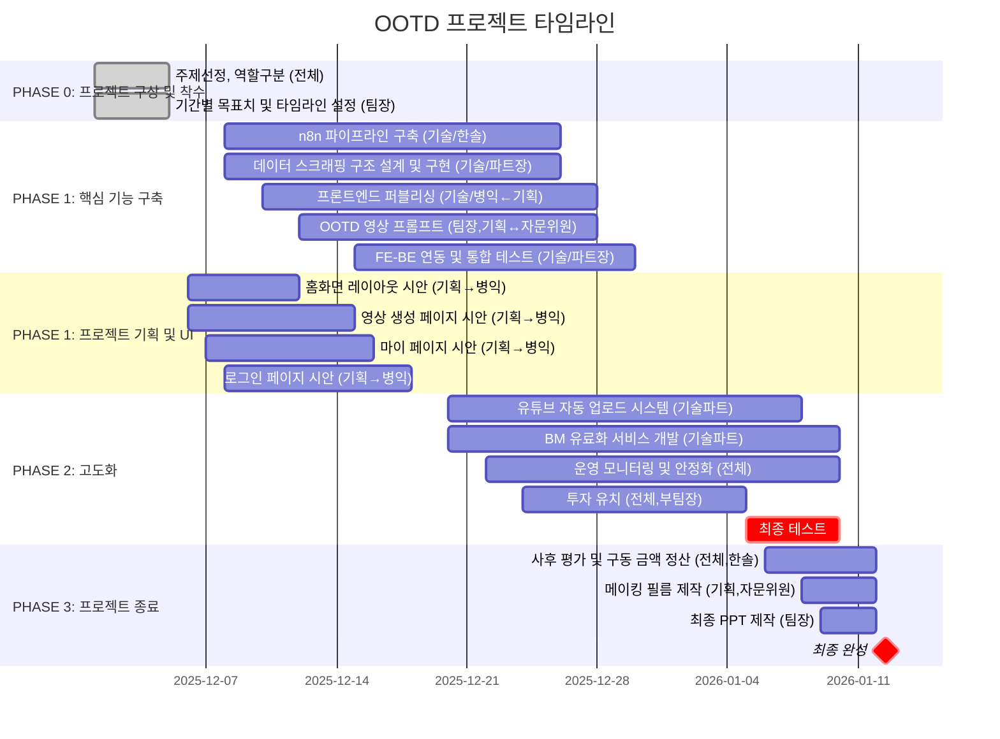

# OOTD 프로젝트 타임라인

## 프로젝트 개요

| 항목 | 내용 |
|------|------|
| 프로젝트명 | OOTD : 오늘 뭐입동? |
| 프로젝트 관리자 | 김찬호 |
| 작성일 | 25.12.02 |
| 최종 완성일 | 2026-01-12 |

---

## 간트차트

---

## Phase별 Task 상세

### PHASE 0: 프로젝트 구상 및 착수

| Task | 담당자 | 진행 기간 | 비고 |
|------|--------|----------|------|
| 주제선정, 역할구분 | 전체 | 12/1 ~ 12/5 | 샘플 1차→2차→완성→최종완성 흐름 |
| 기간별 목표치 및 타임라인 설정 | 팀장 | 12/1 ~ 12/5 | - |

### PHASE 1: 핵심 기능 구축

| Task | 담당자 | 진행 기간 | 비고 |
|------|--------|----------|------|
| n8n 파이프라인 구축 | 기술 / 한솔 | 12/8 ~ 12/26 | 핵심 기능 |
| 데이터 스크래핑 구조 설계 및 구현 | 기술 / 파트장 | 12/8 ~ 12/26 | 핵심 기능과 병행 |
| 프론트엔드 퍼블리싱 | 기술 / 병익 ← 기획 | 12/10 ~ 12/28 | 기획 지원 |
| OOTD 영상 프롬프트 | 팀장, 기획 ↔ 자문위원 | 12/12 ~ 12/28 | 샘플용 |
| FE-BE 연동 및 통합 테스트 | 기술 / 파트장 | 12/15 ~ 12/30 | - |

### PHASE 1: 프로젝트 기획 및 UI

| Task | 담당자 | 진행 기간 | 비고 |
|------|--------|----------|------|
| 홈화면 레이아웃 시안 | 기획 → 병익 | 12/6 ~ 12/12 | 시안·샘플 |
| 영상 생성 페이지 시안 | 기획 → 병익 | 12/6 ~ 12/15 | - |
| 마이 페이지 시안 | 기획 → 병익 | 12/7 ~ 12/16 | - |
| 로그인 페이지 시안 | 기획 → 병익 | 12/8 ~ 12/18 | - |

### PHASE 2: 고도화

| Task | 담당자 | 진행 기간 | 비고 |
|------|--------|----------|------|
| 유튜브 자동 업로드 시스템 | 기술파트 | 12/20 ~ 1/8 | 사전 회의 후 착수 |
| BM(유료화) 서비스 개발 | 기술파트 | 12/20 ~ 1/10 | 사전 회의 후 착수 |
| 운영 모니터링 및 안정화 | 전체 | 12/22 ~ 1/10 | - |
| 투자 유치 | 전체, 부팀장 | 12/24 ~ 1/5 | 소개 자료, 서류 준비, 각종 모임, 유휴금액 확보 |
| 최종 테스트 | - | 1/5 ~ 1/10 | 고도화 산출물 테스트 |

### PHASE 3: 프로젝트 종료

| Task | 담당자 | 진행 기간 | 비고 |
|------|--------|----------|------|
| 사후 평가 및 구동 금액 정산 | 전체, 한솔 | 1/6 ~ 1/12 | 프로젝트 리뷰 |
| 메이킹 필름 제작 | 기획, 자문위원 | 1/8 ~ 1/12 | - |
| 최종 PPT 제작 | 팀장 | 1/9 ~ 1/12 | - |
| **최종 완성** | - | **1/12** | 마감/완료일 |
