# 서비스 파이프라인 플로우차트

```mermaid
flowchart TD
    subgraph STEP1["① 기획 설계"]
        A1[서비스 목적 정의]
        A2[유저 시나리오 / 페르소나]
        A3[정책 / BM 설계]
        A4[기능 정의 및 화면 흐름 설계]
    end

    subgraph STEP2["② 데이터 수집 구조 설계"]
        B1[소스 선정]
        B2[스크래핑 방식<br/>병합/루프]
        B3[데이터 포맷 정리<br/>PDF/XML → Binary]
    end

    subgraph STEP3["③ n8n 자동화 파이프라인 구축"]
        C1[스크래핑 → 이미지 생성]
        C2[이미지 → 영상 생성]
        C3[영상 → 폴더 저장]
        C4[유튜브 자동 업로드<br/>옵션]
    end

    subgraph STEP4["④ 웹 서비스 UX/UI · 퍼블리싱"]
        D1[입력창 · 생성 버튼]
        D2[로그인<br/>구글 ID]
        D3[결과화면 · SNS 공유]
        D4[MYPAGE<br/>생성물 조회/삭제]
    end

    subgraph STEP5["⑤ 출력물"]
        E1[8초 영상]
        E2[이미지 1~2컷]
        E3[워터마크]
    end

    subgraph STEP6["⑥ 저장·배포 & 운영"]
        F1[YouTube 중심 저장]
        F2[운영 모니터링<br/>회원/삭제/이력관리]
        F3[초상권·개인정보<br/>처리 정책 적용]
    end

    subgraph STEP7["⑦ BM / 유료화 / 시스템 확장"]
        G1[무료 체험 → 유료 전환]
        G2[ID별 사용 횟수 제한]
        G3[내 사진 기반<br/>프리미엄 모델]
        G4[제휴<br/>패션몰/브랜드]
        G5[시스템 범위 확장<br/>뷰티/주얼리 등]
    end

    STEP1 --> STEP2
    STEP2 --> STEP3
    STEP3 --> STEP4
    STEP4 --> STEP5
    STEP5 --> STEP6
    STEP6 --> STEP7

    style STEP1 fill:#e3f2fd,stroke:#1976d2
    style STEP2 fill:#f3e5f5,stroke:#7b1fa2
    style STEP3 fill:#fff3e0,stroke:#f57c00
    style STEP4 fill:#e8f5e9,stroke:#388e3c
    style STEP5 fill:#fce4ec,stroke:#c2185b
    style STEP6 fill:#e0f7fa,stroke:#0097a7
    style STEP7 fill:#fff8e1,stroke:#ffa000
```

## 단계별 상세 설명

| 단계 | 주요 내용 |
|------|----------|
| ① 기획 설계 | 서비스 목적, 유저 시나리오, BM 및 기능/화면 설계 |
| ② 데이터 수집 | 소스 선정, 스크래핑 방식, 데이터 포맷 정리 |
| ③ n8n 파이프라인 | 스크래핑→이미지→영상 자동화, 유튜브 업로드 |
| ④ 웹 서비스 | 입력/로그인/결과화면/마이페이지 구현 |
| ⑤ 출력물 | 8초 영상, 이미지 1~2컷, 워터마크 |
| ⑥ 저장·배포 | YouTube 중심 저장, 운영 모니터링, 정책 적용 |
| ⑦ BM 확장 | 유료화, 프리미엄 모델, 제휴, 카테고리 확장 |
